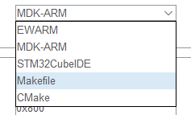
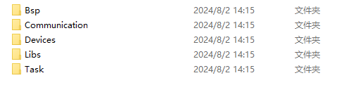

[TOC]

# DDT simple motor test fitting board

-   achieve control of all models of our prototype motors

motor models currently supported:

|      Type      | communication |
| :------------: | :-----------: |
| M0601C_111/411 |     RS485     |
|   M0602C_112   |     RS485     |
| M0603C_111/211 |     uart      |
|   M1502E_111   |      CAN      |
| M1502D_133/233 |      CAN      |
|   M1505A_222   |      CAN      |
| P1010A/P1010B  |      CAN      |
| M0603A_111/411 |      LIN      |

# How to start ?

Welcome to the Debug_Card project! Whether you're a contributor or a user, here's how you can get started with our repository.

https://github.com/DDTMotor/Debug_Card.git

## Prerequisites

Before you begin, ensure you have the following prerequisites installed:

-   [Git](https://git-scm.com/) for version control. 
-   [STM32CubeMX](https://www.st.com/en/development-tools/stm32cubemx.html) for project configuration.
-   An Integrated Development Environment (IDE) such as [Keil MDK-ARM](https://www.keil.com/mdk5) or [GCC](https://gcc.gnu.org/) for ARM. 
-   An debug emulator such as [J-Link](https://www.segger.com/jlink-debug-probes.html) debugger or STLink or DAP-Link

## Getting the Source Code

To get the source code, clone the repository using Git: 

```bash
git clone https://github.com/DDTMotor/Debug_Card.git
```

# How to compile?

You can compile the project using either Keil MDK-ARM or GCC:

- **Using Keil MDK-ARM**: Open the `.ioc` file in STM32CubeMX and generate the project. Import the project into Keil MDK-ARM and start compiling.

- **Using GCC**: Navigate to the project directory and use the `make` command to build the project.

-   ARM-MDK

You can use the stm32cubemx software (double-click the  file debugcard.ioc) to develop your project


-   GCC

you also can using the GCC build tool chain



**Jlink Burn and debug**

I use the Jlink debugger and use the SEGGER RTT  with the J-Link RTT Viewer software to print out the debug log, but you can use other debuggers as well, you just can't print a log using Segger RTT

# project folders explain

|    file     |                           explain                            |
| :---------: | :----------------------------------------------------------: |
| Application | User code folders, including Board Support packages (packaged as devices) , custom macros, and task scheduling related |
|    OLED     |                  OLED screen driver library                  |
| SEGGER_RTT  | The RTT tool, used by J-Link RTT Viewer software, is used to print logs for easy debugging |



# debug problem record

## RS485 communication direction pin control

BL3085N is a half-duplex RS-485 transceiver. A GPIO pin is drawn from the MCU to manually control the direction of communication of the transceiver. When the GPIO outputs a high level, RS-485 is the direction of transmission, that is, the MCU sends data to the bus, when GPIO output is low, RS -485 is the receiving direction, that is, MCU receives the data on the bus

In the code, I write this:

```
// set the rs485 communication direction to send
HAL_GPIO_WritePin(RS485_DIR_GPIO_Port, RS485_DIR_Pin, GPIO_PIN_SET);
// send the data to the motor
HAL_UART_Transmit(huart, buff, (uint16_t)AGT_UART_BUFF_LEN,0xffff);
// set the rs485 communication direction to receive
HAL_GPIO_WritePin(RS485_DIR_GPIO_Port, RS485_DIR_Pin, GPIO_PIN_RESET);
```

Note that I did not add a HAL delay because the motor replies to data very quickly. If you add a delay after the switch level (for example, 20ms) , this will cause the 485 transceiver can not be switched to receive mode in time, MCU lost received motor feedback byte data

## Modify the serial baud rate

​	When using UART communication to control M0603C and M0603A motors, because the baud rate of the two motors is not the same, we need to modify the baud rate of the corresponding serial port peripherals and reinitialize it after the user selects the motor model, this allows a serial port peripheral to support motors with different baud rates

## Motor CAN terminal resistance

​	When I support the motor model M1502E in the debugging process, the 120 terminal ohm resistor on the CAN bus of the motor is disconnected by default, and the terminal resistor of the control board is also disconnected, so the communication fails, the motor is out of control

​	In order to ensure the normal communication in the back, I turned on the CAN bus 120 ohms resistor on the control board (using the dial switch to select, please see the control board schematic for details) , and in the motor initialization time sends the instruction to open the motor terminal resistance, thus can stabilize the communication, and the successful control motor

