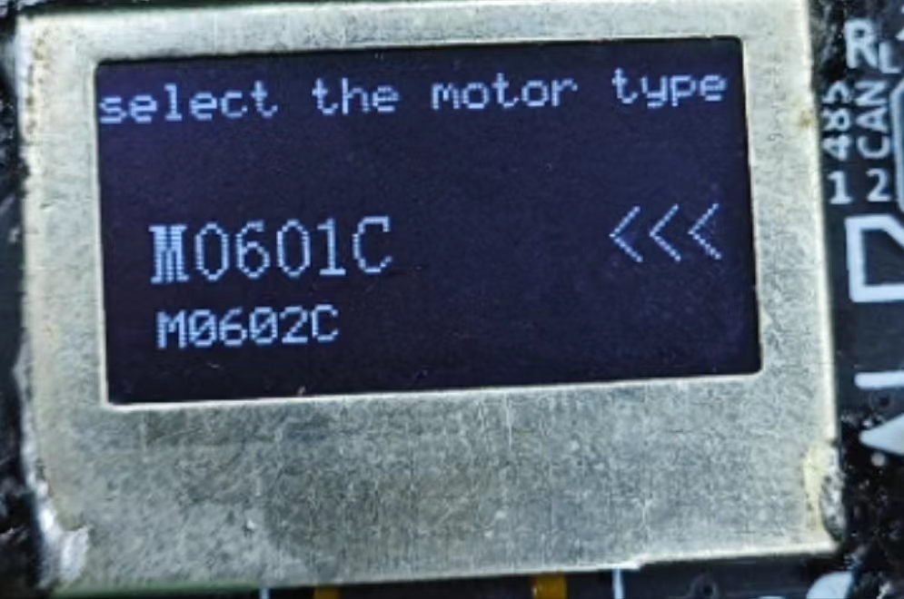
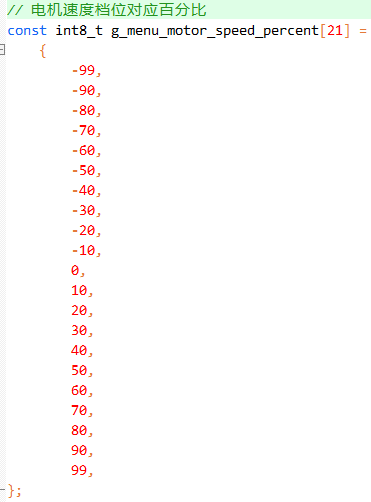
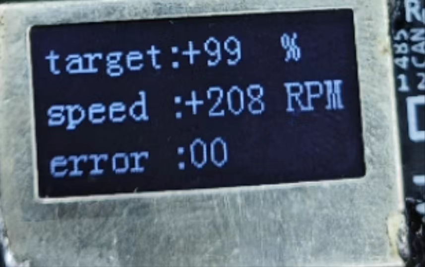

[TOC]

## 简易电机控制配件板介绍

-   可以控制所有标品型号电机

目前支持的电机型号：

|      型号      | 通信方式 |       开发板是否支持        |
| :------------: | :------: | :-------------------------: |
| M0601C_111/411 |  RS485   |             是              |
|   M0602C_112   |  RS485   |             是              |
| M0603C_111/211 |   串口   |             是              |
|   M1502E_111   |   CAN    |             是              |
| M1502D_133/233 |   CAN    |             是              |
|   M1505A_222   |   CAN    |             是              |
|    P1010A/B    |   CAN    |             是              |
| M0603A_111/411 | LIN总线  | 是(需搭配UART转LIN转换模块) |

-   按键 + OLED 的UI页面显示
    1.  在一级页面下，用户通过按键选择电机型号，按“确定”键进入二级页面
    2.  二级页面显示电机实时速度，故障码，温度等信息
    3.  切换速度（10档百分比速度可调）

## 操作说明

### 必备操作：开启CAN终端电阻拨码开关

**使用前需要将CAN终端电阻的拨码开关拨到ON方向（如图示，右边的拨码开关拨到上方）**

### 硬件信息介绍

如图所示，配件板主要分为接线区、屏幕显示、按键、以及Type-C供电四个区域

|   硬件   |                          功能/用法                           |
| :------: | :----------------------------------------------------------: |
|  接线区  | 用来连接电机通信接口（485/CAN/UART等），控制驱动的信号从这里发出给到电机 |
| 屏幕显示 |   一级页面选择电机型号，二级页面显示电机信息，选择控制速度   |
|   按键   |      分为4个按键，分别为上翻页、下翻页、确定、返回按键       |
|  Type-C  |                         给配件板供电                         |

### 详细操作步骤

一级页面操作：

|  按键  |                  对应功能                  |
| :----: | :----------------------------------------: |
| 上翻页 |                选择电机型号                |
| 下翻页 |                选择电机型号                |
| 返回键 |                     无                     |
| 确定键 | 进入二级页面（显示电机信息，选择控制速度） |

二级页面操作：

|  按键  |                      对应功能                      |
| :----: | :------------------------------------------------: |
| 上翻页 | 选择电机百分比速度（无需按下确定按键电机即可转动） |
| 下翻页 | 选择电机百分比速度（无需按下确定按键电机即可转动） |
| 返回键 |          返回一级页面（重新选择电机型号）          |
| 确定键 |                         无                         |

具体操作步骤如下：

1.  首先使用Type-C数据线给配件板上电，忽略图中的4pin端子线（不需要接，这是swd接口，对代码二次开发才需要接），会显示欢迎页面，程序初始化中，如下图所示：

    

2.  待2s时间初始化完成后，进入一级页面，这里的页面功能是选择要测试驱动的电机型号

    

    使用上翻页、下翻页选择电机型号，被选中的电机型号会突出显示，方便区分当前选择，如下图所示，当前选择为M0602C型号电机

    

    如下图所示，选择为P1010A型号电机

    

3.  选择对应电机型号后，按下确定按键进入二级页面，二级页面功能为显示电机信息，选择控制速度

    

    如上图所示，二级页面电机信息主要 有3行

    |         列表         |                           显示信息                           |
    | :------------------: | :----------------------------------------------------------: |
    |        第一行        |                  目标速度（电机百分比速度）                  |
    |        第二行        |                 电机实时反馈速度（单位RPM）                  |
    |        第三行        |                 根据电机型号不同显示不同信息                 |
    | 第三行：电机错误信息 | 电机错误信息(十进制显示,为零代表电机状态正常，非零值查看电机规格书详细说明） |
    |   第三行：电机温度   |                     电机温度，单位摄氏度                     |

    

4.  在当前二级页面下通过上翻页、下翻页选择电机百分比速度，目前支持正负10个档位速度，每个档位百分比如下图：

    

    

5.  按照电机使用参考手册，给电机上电，通过正确的通信信号线连接到配件板

6.  在当前二级页面下通过上翻页、下翻页选择电机百分比速度，电机即可开始转动（无需按下确定按键）

    如下图所示为M1502D电机接线，是CAN通信，接到配件版的接线区的L/H接口

    

    

7.  屏幕上显示通过上翻页、下翻页选择的电机百分比速度以及电机实时RPM转速

    如下图所示（以M1502D为例）：

    +20%

    

    +99%

    

    -50%

    

    -90%

    

    

    **注意**：如果电机驱动不成功，可以查看下第三行，电机错误信息(十进制)，为零代表电机状态正常，非零值查看电机规格书详细说明

    如下图所示，是型号为M0602C的电机，电机期望为20%，但是观察发现实际电机转速为0，而第二行显示的转速为553RPM（明显错误）

    

    第三行显示16，十进制为0x10,查看电机规格书关于错误码的部分：

    

    即电机过温故障

8.  在二级页面按下返回键返回一级页面（重新选择电机型号）

## 各种电机型号接线参考

### 电机接线参考：can通信(M1502E/M1502D/M1505A/P1010AB)

电机使用CAN通信，电机的CAN H/CAN L接到配件版的接线区的H/L接口

| 电机端 | 配件板(看丝印) |
| ------ | -------------- |
| CAN_H  | H              |
| CAN_L  | L              |

###                                                                                                                                                                                                                                                                                                                                                                                                                                                                                                                                                                                                                                                                   电机接线参考：RS485通信(M0601C/M0602C)

电机使用RS485通信，电机的通信接口连接配件板的接口

| 电机端  | 配件板(看丝印) |
| ------- | -------------- |
| RS485_A | A              |
| RS485_B | B              |

如下图所示，

### 电机接线参考：UART通信(M0603C)

电机使用UART通信，电机的通信接口连接配件板的接口

| 电机端      | 配件板(看丝印) |
| ----------- | -------------- |
| UART_TX     | R              |
| UART_RX     | T              |
| 电机电源GND | G              |

如下图所示，

$$
注意：电机的电源GND一定要和配件板共地，否则影响UART通信，无法控制。
$$

### 电机接线参考：LIN总线通信(M0603A)

电机使用LIN总线通信，需要用到LIN 转 TTL 模块(关于此模块详情可看M0603A电机参考使用手册)

其中电机线束接口直接插连 LIN 转 TTL 模块对应母头。电源正负极分别和 LIN 转 TTL 模块正负极连接

LIN 转 TTL 模块的通信接口连接配件板的接口

| LIN 转 TTL 模块 | 配件板(看丝印) |
| --------------- | -------------- |
| TXD             | T              |
| RXD             | R              |
| 电机电源GND     | G              |

如下图所示

$$
注意：电机的电源GND一定要和配件板共地，否则影响UART通信，无法控制。
$$

## 注意事项 && FAQ

**注意：**

1.  使用RS485与CAN总线通信控制电机时，不需要连接GND
2.  **使用UART（包括LIN 转 TTL 模块）控制电机时，必须连接GND，配件板的GND与电机电源共地，否则影响UART通信，无法控制**
3.  上电顺序：原则上配件板与电机上电顺序没有要求，建议先将线路连接好，给电机上电，再用Type-C数据线给配件板上电，接着选择型号等操作......
4.  必须在一级页面对电机上电，以下这种情况会导致电机控制失败：进入二级页面后，再对电机上电，此时因为电机ID设置，模式等不成功，驱动指令无法匹配电机内部指令，驱动失败，**此时可以返回到一级页面，选择电机型号后，重新进入二级页面**
5.  在测试完一个电机，更换另一个新电机后，**配件板可以不用重新上电，但是需返回到一级页面，选择电机型号后，重新进入二级页面**

**提示：**

1.  配件板为了支持列表里的所有电机型号，对将电机统一设置ID为1，设置模式为速度环

2.  二级页面的10个正负档位是百分比，对每个电机的空载转速做了计算处理，所以不同型号电机同样的百分比速度下对应的转速（RPM）是不一样的

    

**F:** 为什么接上电机，选择速度后无法控制？

**Q:** 先检查连线，有些型号电机需要连接GND,再检查电机型号是否选择正确，如果是CAN通信电机检查拨码开关是否正确操作

**F:** 为什么有些电机在二级页面看不了温度？

**Q:** 根据电机型号不同，二级页面显示分为故障码和电机温度

